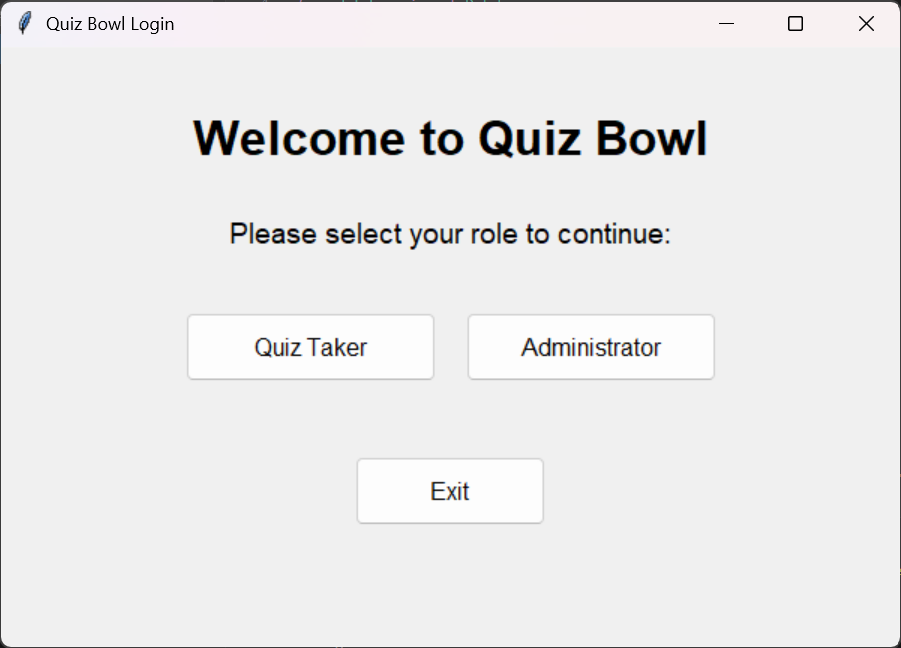
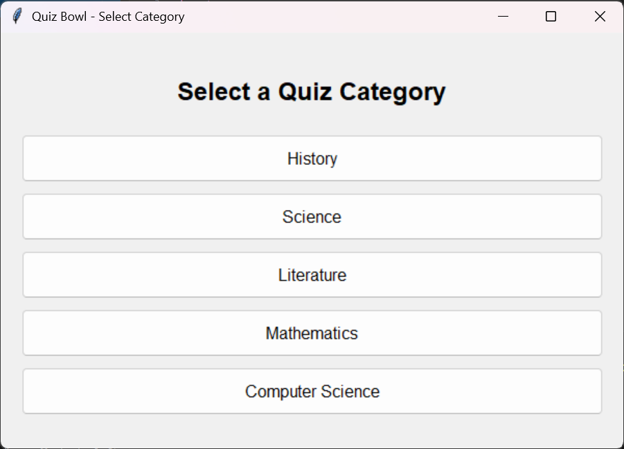
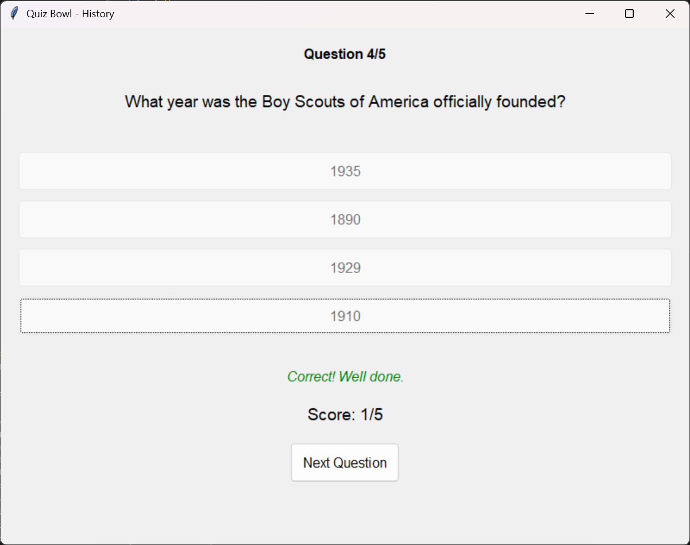
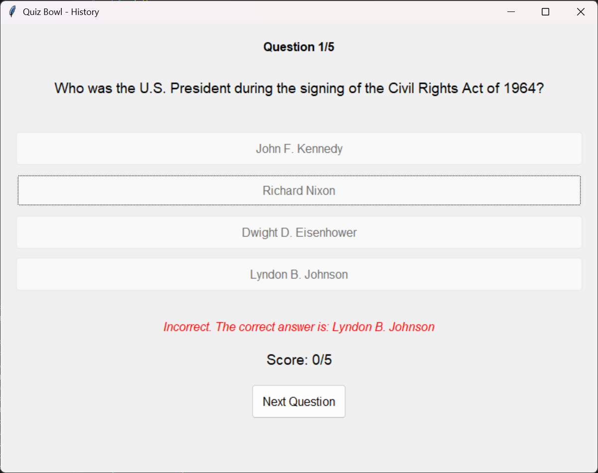
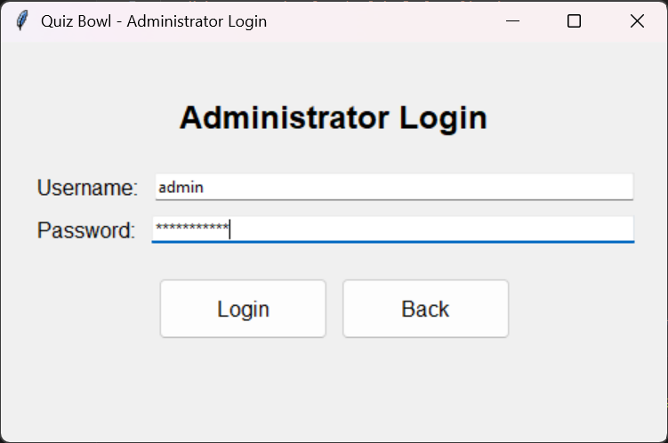
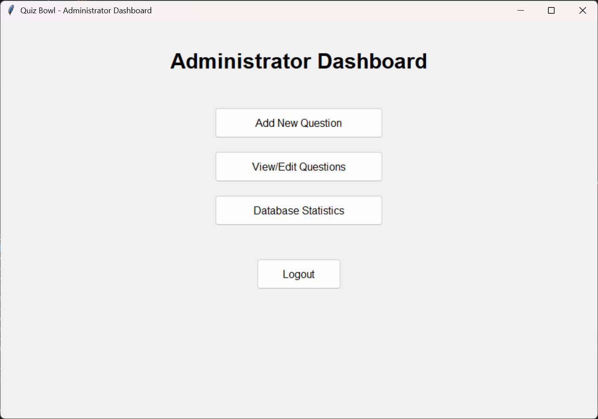
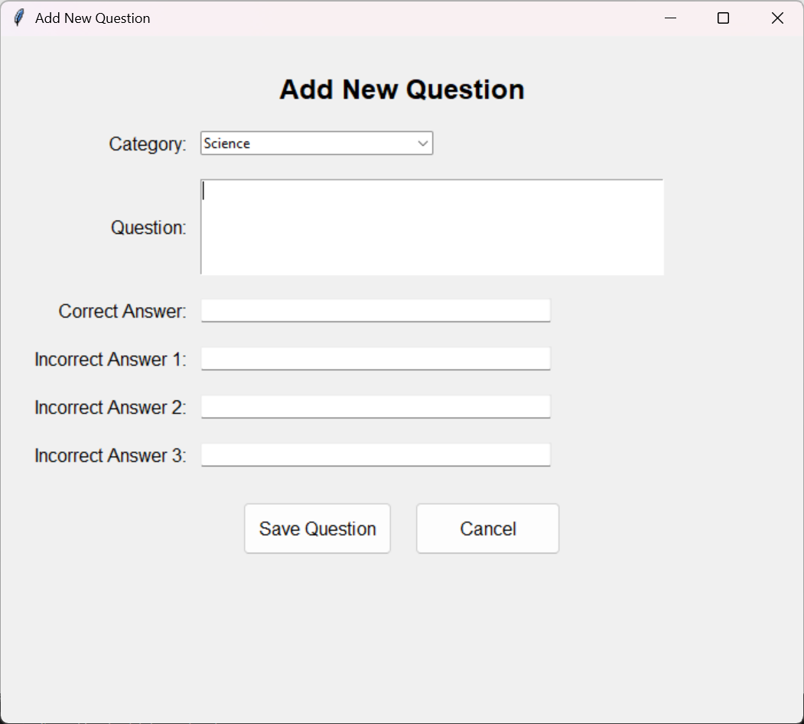
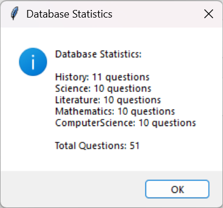
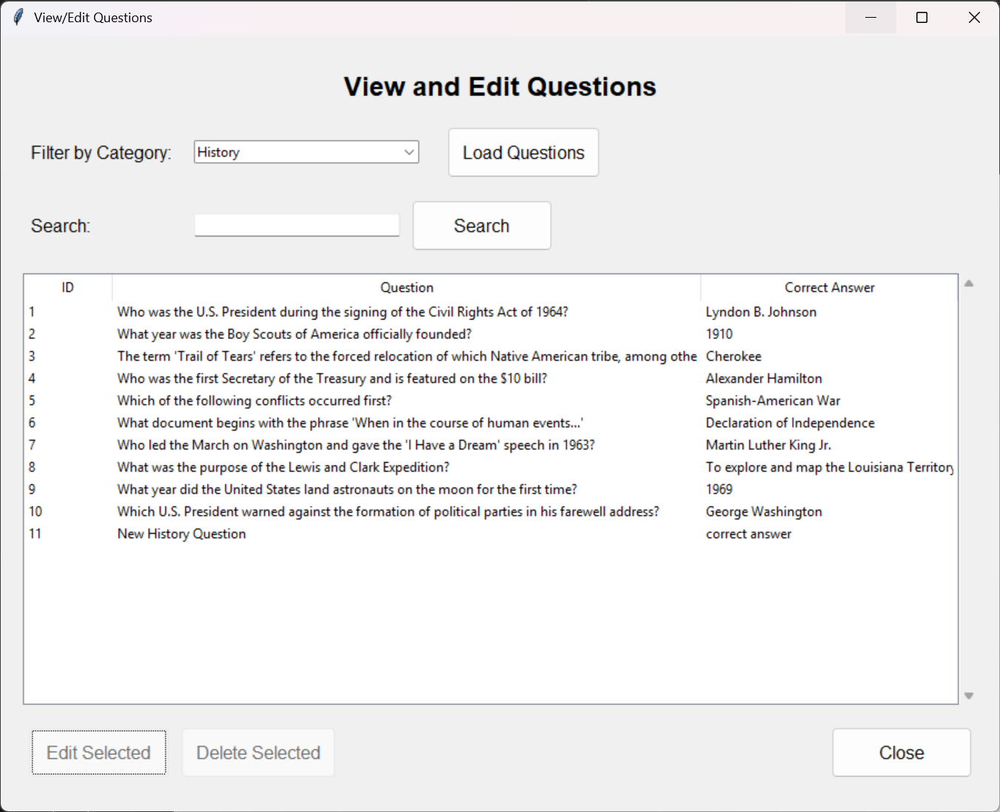
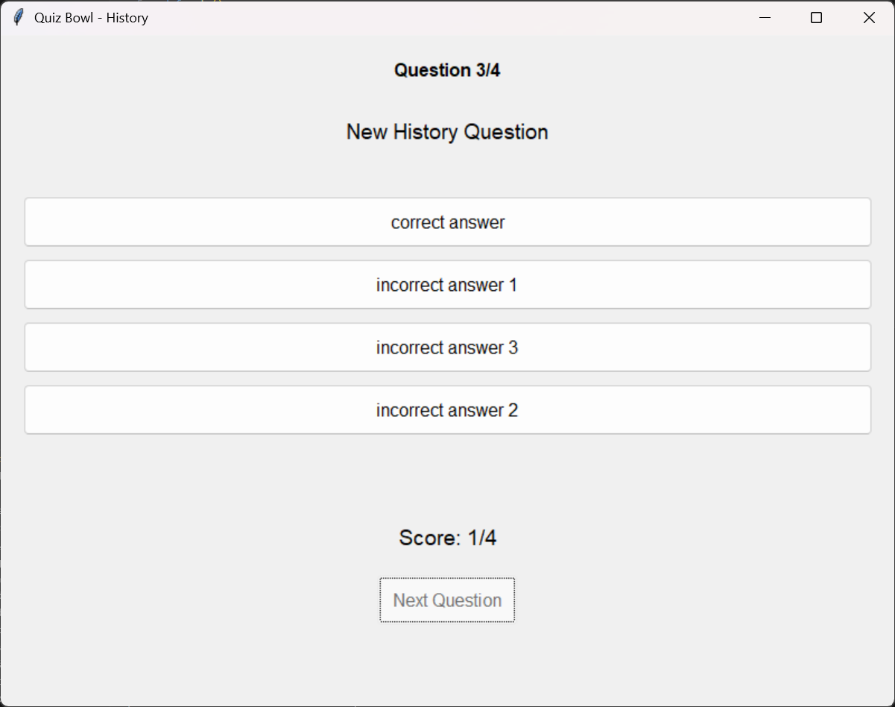

# Quiz Bowl Application

A Python quiz application developed for DS3850 Quarterly Assessment 3. This application allows users to take quizzes in different categories and administrators to manage questions.

## Features

- **User Features:**
  - Select from 5 different quiz categories
  - Take interactive quizzes with multiple-choice questions
  - Receive immediate feedback on answers
  - View final score and performance summary

- **Administrator Features:**
  - Secure login system
  - Add new questions to any category
  - View, edit, and delete existing questions
  - Search questions by text
  - View database statistics and question counts

## Installation

1. Clone this repository
2. Ensure Python 3.7+ is installed
3. Install required packages: `pip install tk sqlite3`
4. Run the application: `python main.py`

## Usage

### As a Quiz Taker
1. Start the application and select "Take Quiz"
2. Choose a category
3. Answer the questions
4. View your final score

### As an Administrator
1. Start the application and select "Administrator"
2. Login with credentials:
   - Username: admin
   - Password: password123
3. Use the dashboard to manage questions

## Project Structure

- `main.py` - Application entry point
- `database.py` - Database management
- `login.py` - Authentication screens
- `admin.py` - Administrator interface
- `question.py` - Question class
- `quizInterface.py` - Core quiz logic
- `quizUI.py` - Quiz user interface
- `sampleQuestions.py` - Initial sample questions for database population
- `quizBowl.db` - SQLite database file
- `projectDescription.md` - Assignment requirements
- `.gitignore` - Git ignore file
- `README.md` - Project documentation

### Database Management
- Database class with session management
- Question storage in category-specific tables
- Functions for CRUD operations (Create, Read, Update, Delete)

### User Interface
- Login screen with role selection
- Quiz interface with multiple-choice questions
- Admin dashboard for question management

### Quiz Logic
- Question class for encapsulating quiz questions
- Random question selection
- Score tracking and feedback

## Technologies Used

- Python 3.8
- Tkinter for GUI
- SQLite for database

## Screenshots

### User Interface

*Initial screen where users select their role as Quiz Taker or Administrator*

*Quiz takers can select from five different categories (History, Science, Computer Science, etc.)*

*Instant feedback when a user selects the correct answer, with visual confirmation*

*Feedback when a user selects an incorrect answer, showing the correct response*

### Administrator Interface

*Secure administrator login screen requiring username and password*

*Main administrator dashboard with options for managing quiz content*

*Interface for adding new questions to the database with category selection*

*Overview of database statistics showing question counts by category*

*Question management interface with search, edit, and delete functionality*

*Detailed form for creating new questions with correct and incorrect answers*

## Author

Samuel Rumbley